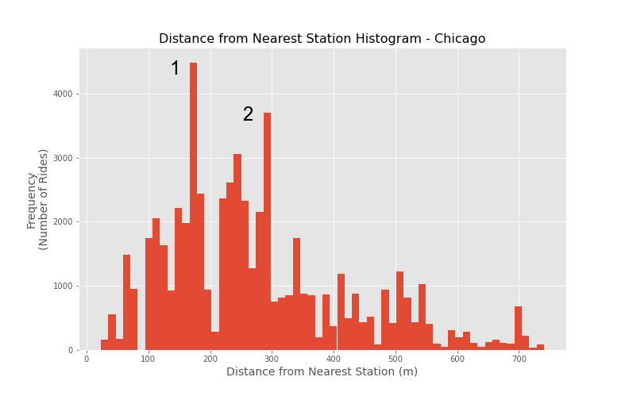
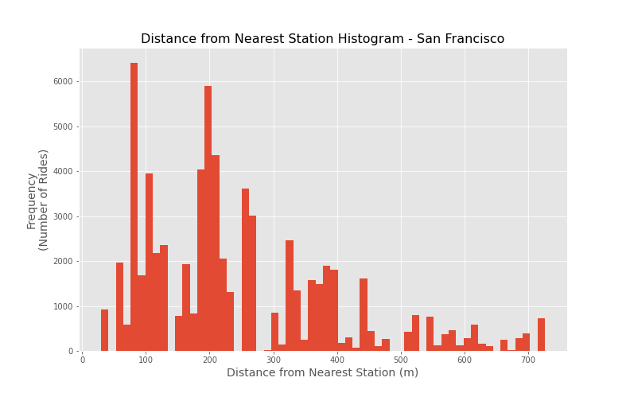
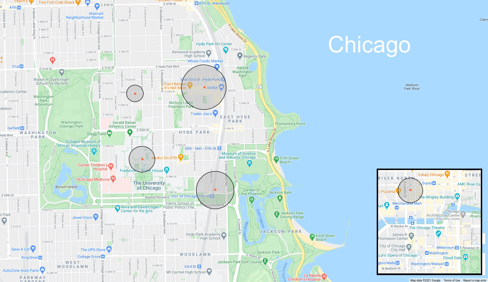
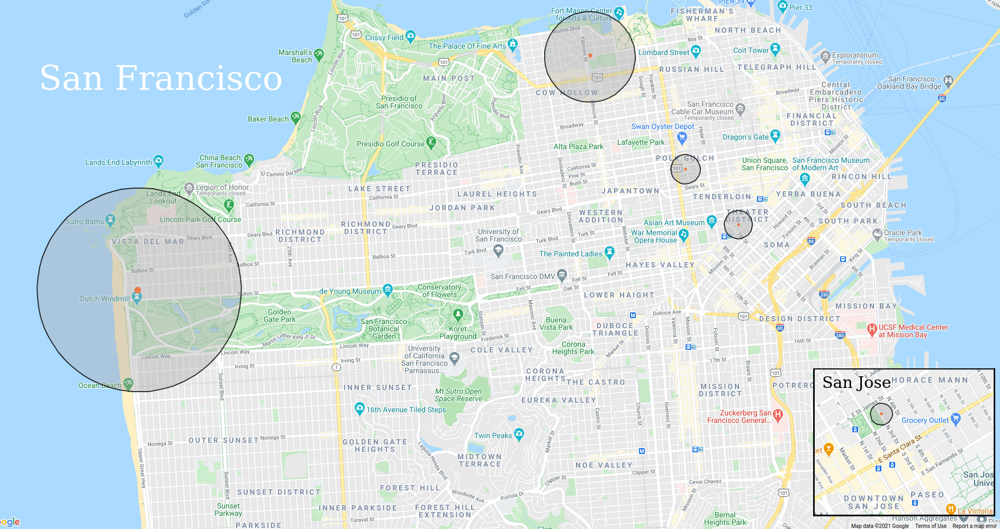

# Modeling Electric Rental Bike Lock Ups

## Project Overview
A predictive model based analysis of electric rental bikes and how far away from any given docking station people are locking them up.

This study found that select measurements (traffic, time of day, trip time, rideshare membership, city, and whether or not a bike started at a station) all have a small but measurable impact on how far an electric bike is parked from the nearest station. There are also some places where riders disproportionately park near but not *direct at* the docking station and these places are worth investigating.

>Check out the five minute [slide](https://docs.google.com/presentation/d/13HS4gf5k2q1FyS6gMuHpQNHTizOUYrWCvgY-HT9nRO0/edit?usp=sharing) version of this repo!

## The story
Electric bikes are an amazing innovation that bring access and much more range to riders. They're a welcome addition to rental programs already known for their [benefits](https://www.outsideonline.com/2136406/do-bike-share-systems-actually-work) on metropolitan areas.

For a regular bike rental, a bike is considered returned once it is back in a slot at a station. Electric bikes (for many reasons) have changed the game, and they can be locked anywhere in town there's a bike rack. Obviously it’s better if people leave them at stations for charging and security, so there is a cost. And companies know this: they have started included incentives like small discounts for returning a rental all the way to the station.

But the truth is electric bikes are still relatively new, and rentals even more so. The market is [developing](https://www.lyft.com/bikes/bay-wheels/service-log) and we still have so much to learn. What can we discover from the data on where bikes are dismounted?

## Data Prep and Cleaning

#### Data sources
This data comes from public sources:

The San Francisco Bay Wheels bike share [data](https://s3.amazonaws.com/baywheels-data/index.html)
- 13 columns, 300k rows (Sept/Oct 2020)
- Includes rides and stations in San Jose
The Chicago Divvy bike share [data](https://divvy-tripdata.s3.amazonaws.com/index.html)
- 13 columns, 648k rows (Sept/Oct 2020)
National Oceanic and Atmospheric Administration's Global Surface Summary of Day [data](https://www.ncei.noaa.gov/metadata/geoportal/rest/metadata/item/gov.noaa.ncdc%3AC00516/html#)
- 28 columns, 365 rows (one per calendar day)
San Francisco Municipal Transportation Agency's Taxi Trips During Covid [data](https://www.sfmta.com/reports/taxi-trips-during-covid-19)
- 1 column, 383 rows (one per day since COVID began), proxy for amount of traffic on the road
Chicago Transit Authority's Daily Boarding Totals
- 5 columns, 7000 rows

Some files may need to be unzipped, which is not shown in this notebook. NOAA's data comes with a separate file for each weather station. The code for each specific station can be found with their search tools online.

#### Preparation and cleaning
We'll combine all of our data together and engineer a few extra features so we can both model our data but also dig in and explore it. Particularly import is our target feature: a bike's distance from the nearest station when it's parked. Most of our analyses and our model will center around this metric.

>For a more complete look at the code and statistics used, check out this [notebook](https://github.com/nick-kopy/Modeling-Electric-Rental-Bike-Lock-Ups/blob/main/model.ipynb).

## Exploratory Data Analysis
Let's look at the data in different ways and see if we can glean any insights, especially from our target feature.

Again note that we are ONLY looking at rentals of electric bikes.

First some descriptive statistics:
>69% of electric bike rides ended at a docking station
>The mean distance to a station for undocked rides was 412 meters.
>San Francisco had a higher proportion (40%) of undocked rides than Chicago (24%)
Among undocked bikes.
>In San Francisco 38% were within 200 meters of a docking station (about a 1 minute walk)
>In Chicago 35% of rides ending within 200 meters of a station

Now let's look at how undocked rides are distributed for each city.

You can see there’s a somewhat normal distribution but with some sudden spikes. What this says is that there’s some sort of pattern of riders parking a specific distance from a station. And indeed when we look into the makeup of each spike, one station makes up a disproportionate amount. Specifically spike 1 is mostly rides near the University Ave & 57th station. Spike 2 is about half composed of Blackstone Ave & Hyde Park Blvd. 

San Francisco has a similar spike which is mostly explained by the Saint James Park station in San Jose. In fact undocked bikes are parked at an average of only 80 meters, probably close enough to see the station in many cases. Why would people get close enough to see the station but not dock their bike? The app gives a discount for docking at a station, so why would people just throw their money away?

Another angle we can take to tackle the data is to visualize the stations that are most often *almost* parked at. Using this nifty [online tool](https://www.mapdevelopers.com/draw-circle-tool.php) we can draw ourselves a [map](https://www.mapdevelopers.com/draw-circle-tool.php?circles=%5B%5B1457.13%2C37.7727156%2C-122.5089787%2C%22%23AAAAAA%22%2C%22%23000000%22%2C0.4%5D%2C%5B78.84%2C37.3393721%2C-121.8900498%2C%22%23AAAAAA%22%2C%22%23000000%22%2C0.4%5D%2C%5B210.27%2C37.7881975%2C-122.4203988%2C%22%23AAAAAA%22%2C%22%23000000%22%2C0.4%5D%2C%5B646.2%2C37.8026239%2C-122.4359166%2C%22%23AAAAAA%22%2C%22%23000000%22%2C0.4%5D%2C%5B200.68%2C37.7810937%2C-122.4118281%2C%22%23AAAAAA%22%2C%22%23000000%22%2C0.4%5D%5D) to visualize the top five stations and how far away bikes are being parked on average.

These stations are surprisingly clustered. Although one is near the famous landmark The Bean (aka Cloud Gate), the other four are all in Hyde Park near the University of Chicago. It's definitely worth investigating this area, not necessarily because something is going wrong but because there is a lot of activity here. You might say that students are lazy and inconsiderate, but it may be that the university students have a culture of leaving their bikes all over the place. That they *like* having bikes all over the place. That way they don't have to always walk to a station. This begs further questions: Are other universities like this one? Should Divvy try to encourage students to be more like other users, or other users to be like students? Might bikes being everywhere be causing problems? Research begets further research.

And next we'll look at the same map for San Francisco and San Jose.

The big ring on the left (48th Ave at Cabrillo St station) makes sense if you think about it. It's farther from downtown so there's bound to be fewer stations and a lot of bikes are probably left in the park or along the beach.

That little ring in San Jose though (Saint James Park station), that's the same station that had a weird 80m spike! You can see pretty clearly now that lots of bikes are being dropped off within 1 city block, which is crazy. Why would you park so close and not dock your bike? 

The truth is I don't know. But if I worked for this company I would be submitting reports and asking questions. These stations are worth investigating.

## Predictive Model

Now we'll bring our data all together and make a model that predicts distance from nearest station. Because we want to make inferences from the inner workings of the model (feature weights) we will use a parametric model and examine assumptions of independence and identical distribution.

>For a more in depth look at model evaluation, check out this [notebook](https://github.com/nick-kopy/Modeling-Electric-Rental-Bike-Lock-Ups/blob/main/model.ipynb).

Rather unfortunately our weather data needed to be dropped because it violated the assumption of linear independence in our data. 

Once we scale our data and tune hyperparameters and we're sure we have the best possible model given our data we take a look at some evaluation measures.  
>Number of features used: 6
>RMSE: 340
>Comparison to baseline: ~6% improvement
>- Where a baseline model always predicts 128m (the mean distance)

So our model only did 6% better than always guessing 128m. That's not great, so take the following with a grain of salt (or at least a small effect size), but it's not nothing. So where this model has succeeded let's see what it tells us.

The model seems to suggest that if a rider has a membership with the bikeshare company, the bike is likely to be docked closer. Bikes in San Francisco and Chicago are about dropped off at about the same distance, but bikes in San Jose are likely dropped off farther away. More traffic and longer trips mean bikes are likely dropped off farther from stations. As it gets later in the day bikes are likely closer to stations. 

## Conclusion
Electric bikes are certainly now a part of the bike rental market. People have the option to lock up their rentals at any bike rack they find instead of returning it to a docking station. And seeing that about a third of rides end away from a station, people are utilizing that option. We learned that undocked bikes are on average parked about 400 meters from the nearest station, just a 2-3 minute walk. We also learned that despite the density of stations in downtown areas, most undocked bikes can be found there. Interestingly riders around University of Chicago (and probably other universities) particularly don't mind leaving their bikes undocked. Looking at the distribution of nearest station distances, we saw a pretty normal spread but with sudden spikes, meaning there's some kind of pattern of people consistently leaving their bikes some distance away. And indeed these spikes could mostly be explained by specific stations. These places can now be the target of investigation.

We also built a machine learning model that tries to predict how far a bike will be parked from the nearest station to see what we could glean from it. By interpreting the model we saw that traffic, time of day, trip time, rideshare membership, city, and whether or not a bike started at a station all had an impact on our target, but even all together the effect was small. And if you think about it there's really only one big question for people when they decide to return their bike to a station or not: "is there a station close to where I'm going?" Although we can't measure this directly, there is definitely data we could gather that approximates this. Things like density of points of interest or economic activity near stations could be great future directions for this project.

Weather we unfortunately could not fit into our model in any meaningful way however our data was only across two months (in which it didn't even rain!). A future model might include an entire year's worth of data with all the temperature and precipitation fluctuations that it brings. But electric bike rentals are still somewhat new, and there's still only a handful of months that even have a robust enough amount of data.

As the electric bike rental market and culture grow it will be fascinating to see what new innovations will come out and what trends we may discover from our observations.
